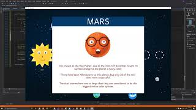
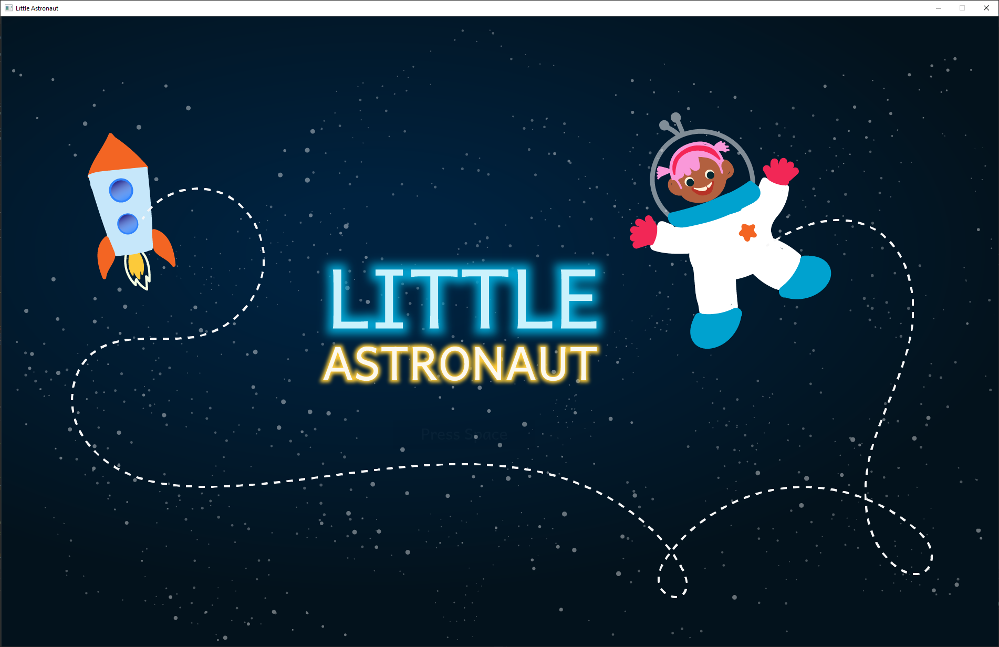
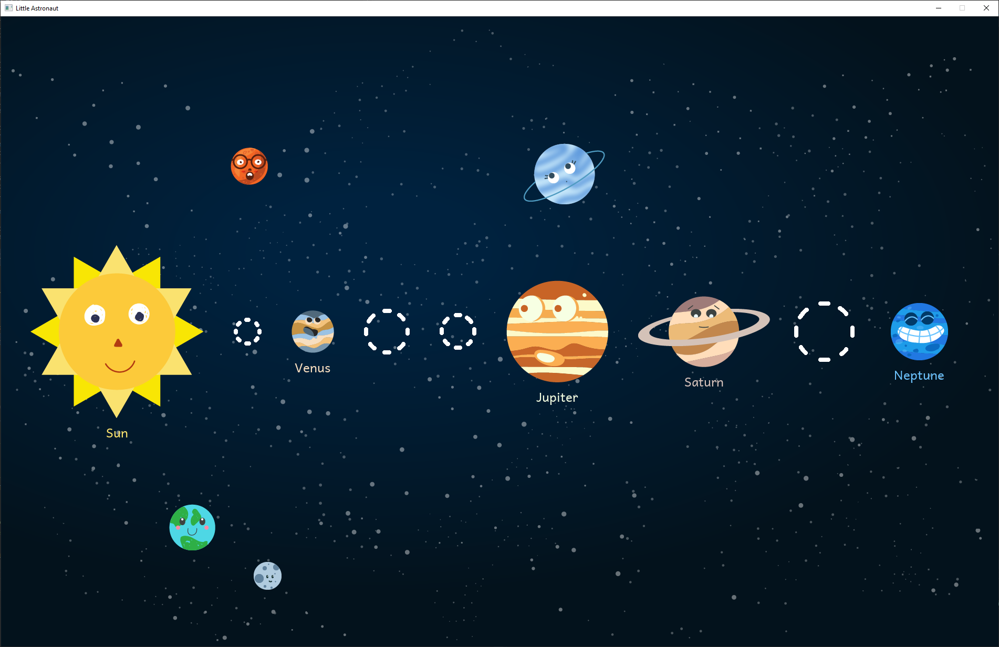
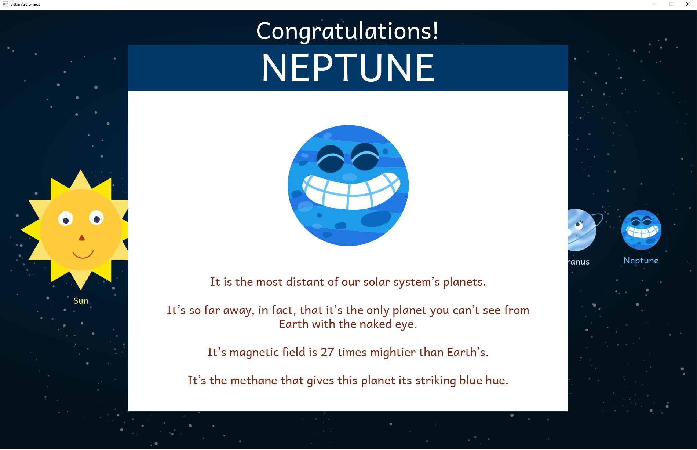
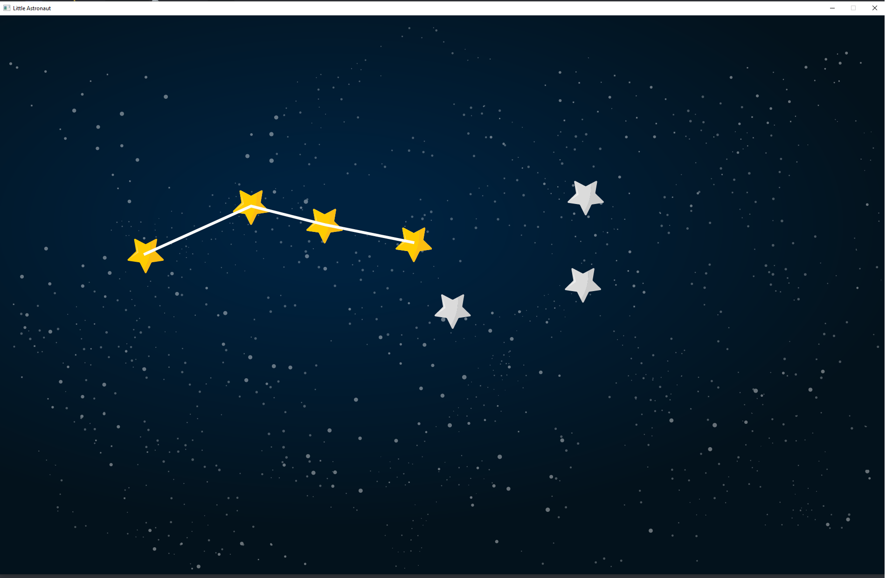
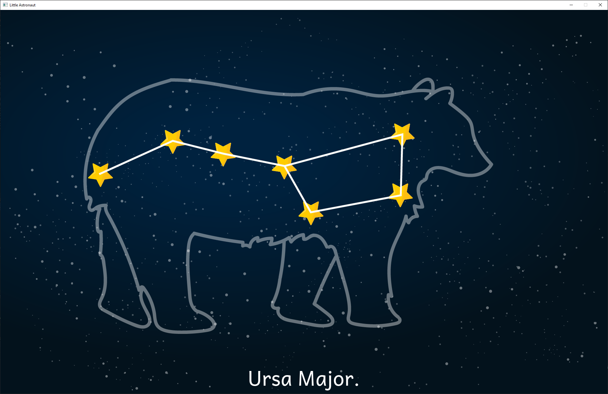

# LittleAstronaut
LittleAstronaut is a game made for Give Back Hacks 2020

>>Click the image below for a demo reel

>>

gameplay

gameplay

planet information

constellation

ursa major

Link to google drive .zip file with .exe 
[Disclaimer may not work if you do not have Visual Studio installed on your computer]
[Disclaimer resolution was hardcoded as 1900 x 1200]

https://drive.google.com/file/d/1t5aSwF5GbsjaJ_YRola1wnjOuV2ADCu_/view?usp=sharing

Download the .zip file, extract it and run the .exe file to play LittleAstronaut
